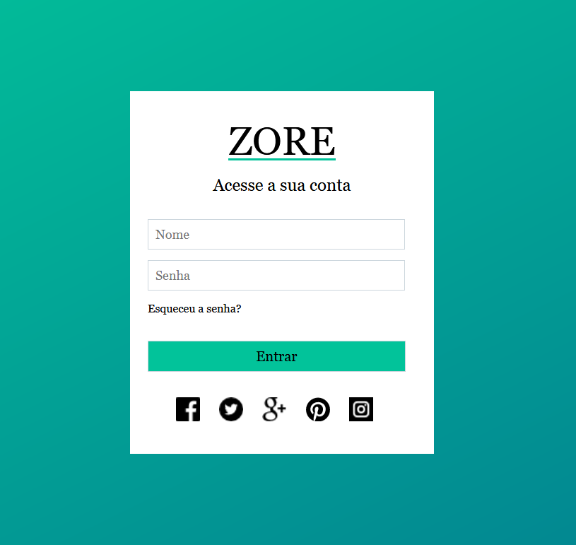

# Projeto: Tela de acesso

Desenhar uma tela de acesso com HTML e CSS

### Utilidade:

- Aprender a usar HTML e CSS

#### Material:

- HTML
- CSS

#### Modo de uso:

- Abra um terminal ( cmd/propt de comando )
- Clone o repositório ( git clone git@github.com:RobMota/screen-login-html-css.git ) em algum local de preferência
- Acesse a pasta ( cd screen-login-html-css )
- E abra o arquivo index.html em seu navegador de preferência ( Ex: Chrome, Firefox... )

### Créditos de Imagem

- [Font Awesome](https://fontawesome.com/)

### Modo responsivo

Deixe o navegador em Responsive Design Mode ( Firefox - Ctrl + Shift + M )
